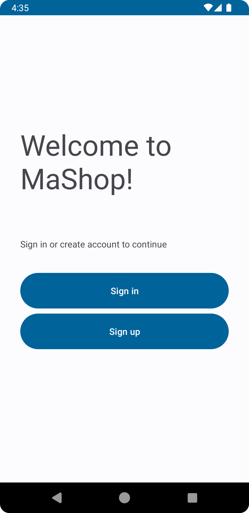
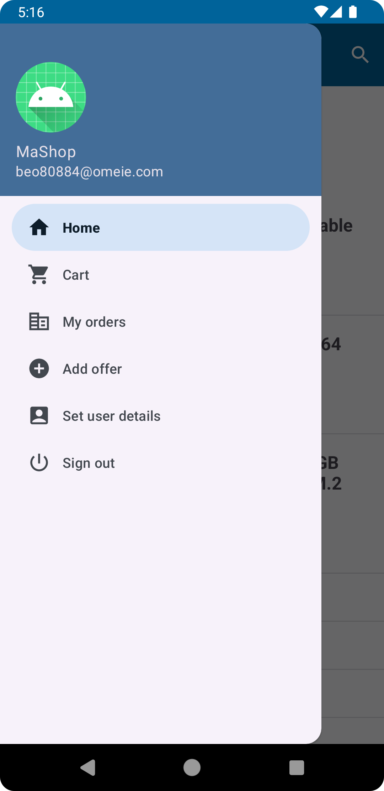
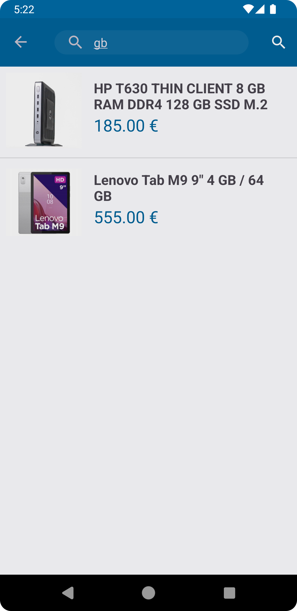
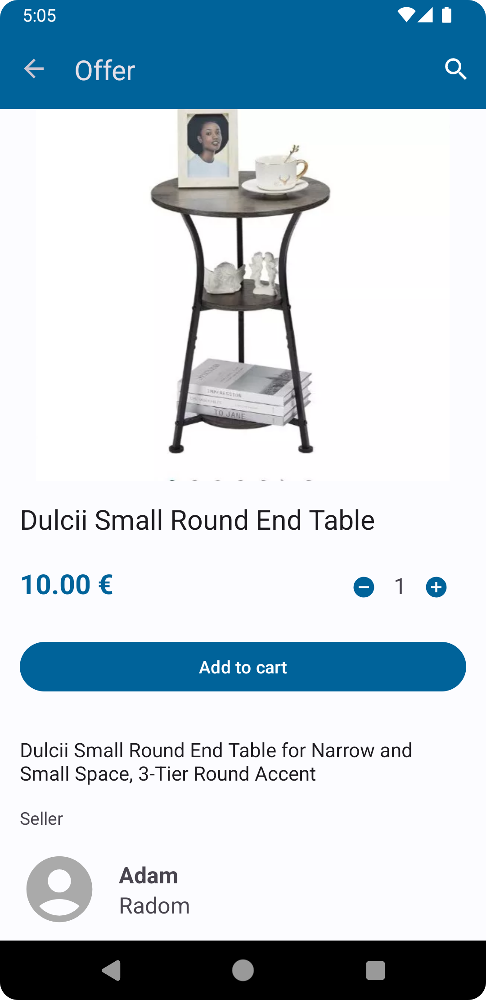
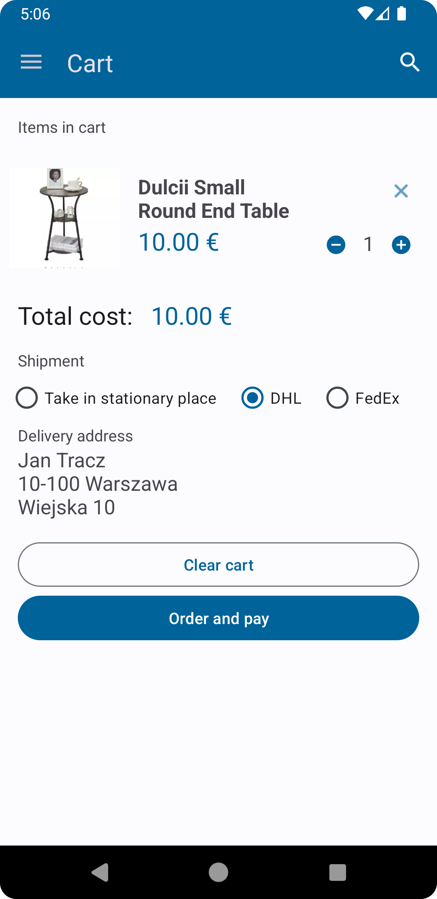
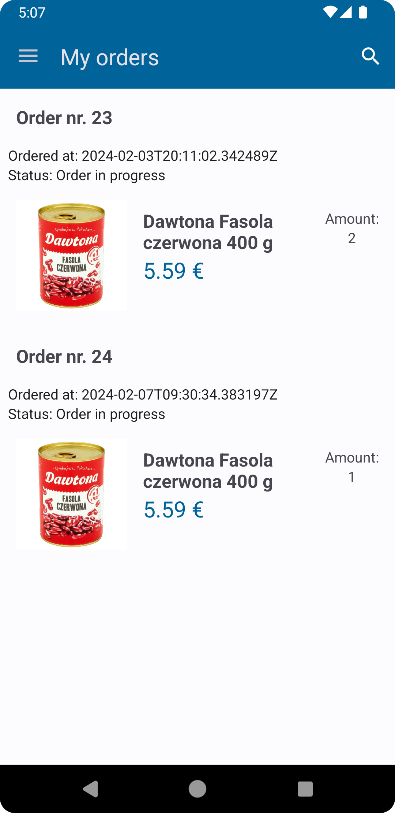

# Mashop

Mashop is a e-commerce application built with Kotlin for Android. It integrates with Supabase for backend services, including authentication, database, and storage.

## Screenshots

  

  

## Features

### User Authentication
- **Sign Up & Sign In**: Secure user authentication using Supabase's email and password-based login.
- **Session Management**: Persistent user sessions with automatic re-login.

### Product Management
- **Add Offers**: Sellers can create new product listings with images, descriptions, and pricing.
- **Search & Filter**: Users can search for products by keywords or browse by categories.
- **Image Upload**: Product images are uploaded and stored in Supabase's storage bucket.

### Shopping Cart
- **Cart Management**: Add, update, or remove items from the shopping cart.
- **Price Summary**: Real-time calculation of the total price in the cart.
- **Order Placement**: Place orders directly from the cart.

### Order Tracking
- **My Orders**: View past orders with details like order date, status, and items purchased.
- **Order Details**: See individual order items, quantities, and prices.

### User Profile
- **Profile Management**: Update user details like name, address, and contact information.
- **Shipping Address**: Automatically populate shipping details during checkout.

### Admin Features
- **Seller Dashboard**: Manage product listings and view sales data (future enhancement).

### Modern UI/UX
- **Material Design 3**: Clean and responsive UI using Material Design components.
- **Dark Mode Support**: The app supports both light and dark themes.

## Tech Stack

### Frontend
- **Kotlin**: Primary programming language for Android development.
- **Glide**: Image loading and caching library.

### Backend
- **Supabase**: Backend-as-a-Service for authentication, database, and storage.
  - **PostgREST**: RESTful API for database operations.
  - **Storage**: For managing product images.
  - **Auth**: Secure user authentication.

### Libraries
- **Kotlinx Serialization**: For JSON parsing and serialization.
- **Ktor**: HTTP client for API communication.
- **Coroutines**: Asynchronous programming for better performance.

## Installation

1. Clone the repository:
   ```bash
   git clone https://github.com/moustaxx/mashop.git
   ```
2. Open the project in Android Studio.
3. Add your Supabase credentials to `local.properties`:
   ```
   SUPABASE_URL=your_supabase_url
   SUPABASE_ANON_KEY=your_supabase_anon_key
   ```
4. Build and run the app on an emulator or physical device.

## Future Enhancements
- **Push Notifications**: Notify users about new offers and order updates.
- **Payment Integration**: Add support for online payments.
- **Analytics Dashboard**: Provide insights for sellers.